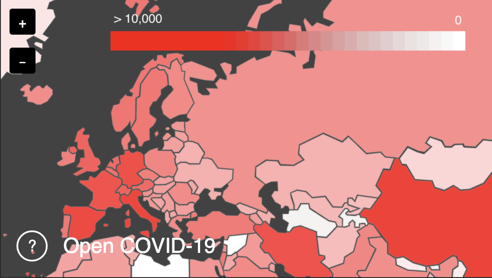

# Open COVID-19 Explorer
This repository contains an interactive map that allows to explore data related
to COVID-19. Selecting a country for the map displays data related to COVID-19
for the specific country, including a forecasting model if available.



### Data
The dataset used for this interactive map is the [Open COVID-19 Dataset][1],
which contains total confirmed positive cases and total fatal cases for all
reporting countries as well as subregions of USA, China and Spain.

### Building the website
The website is automatically built upon a Git push. To build it manually, run:
```sh
# Install dependencies
npm install
# Build web components
npm run-script build
# Start web server in port 8080
npm run-script start
```

[1]: https://github.com/open-covid-19/data